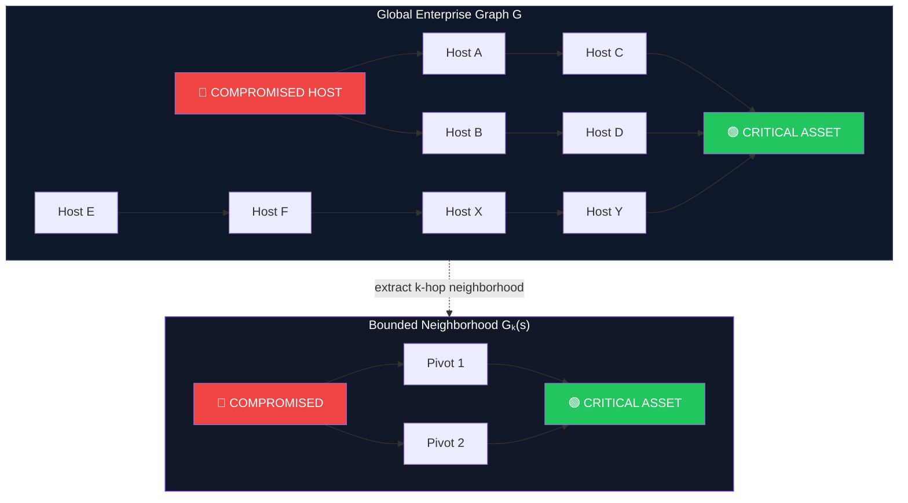
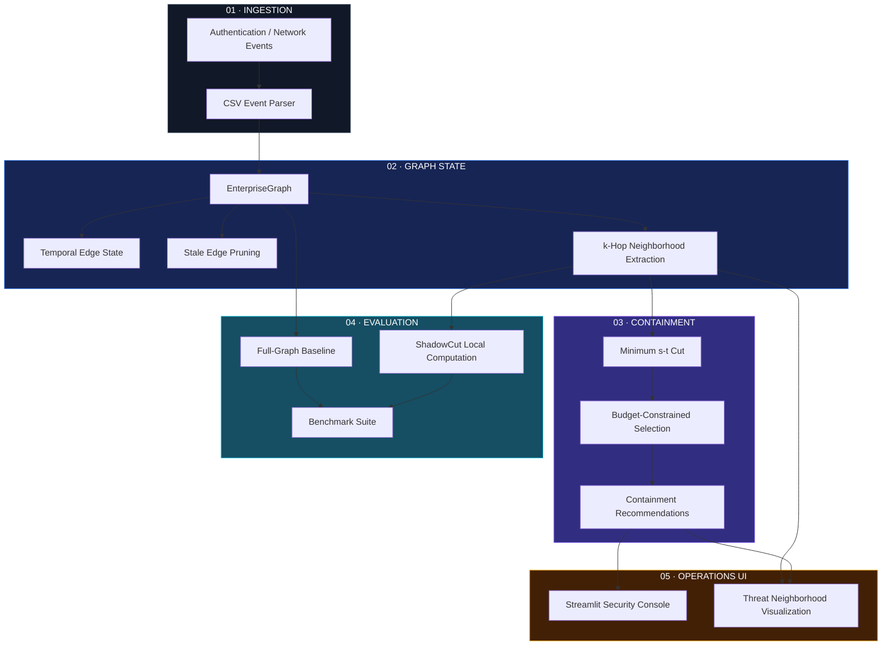
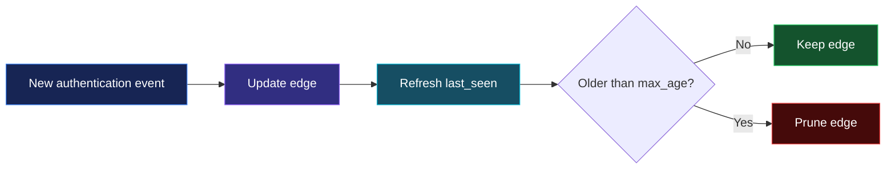
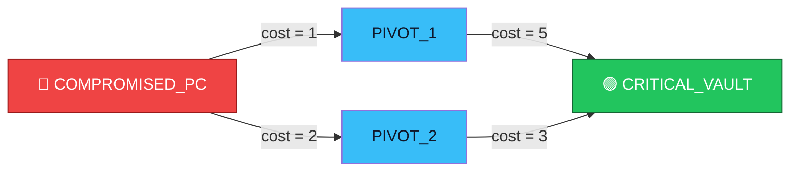
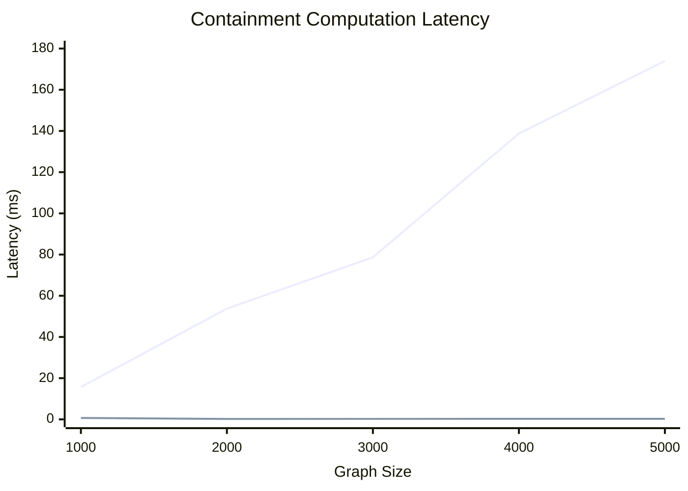
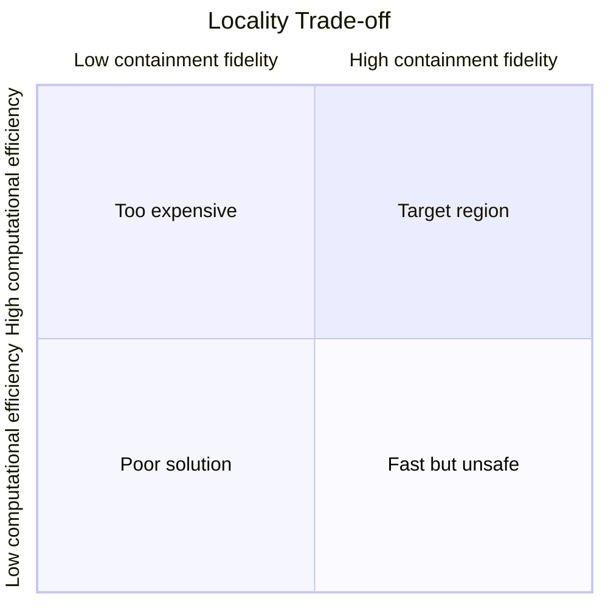
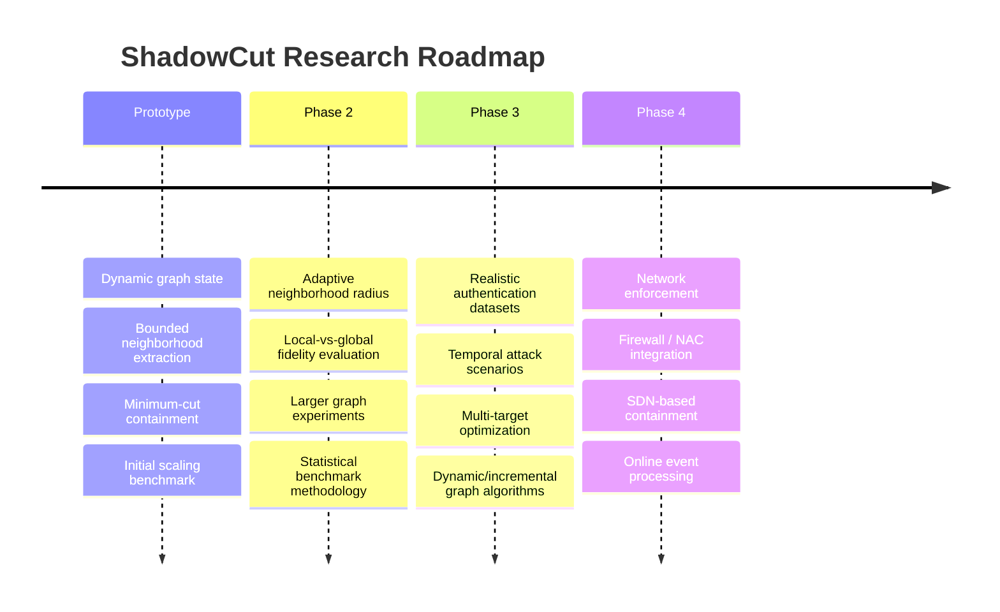

<div align="center">

# ShadowCut

### **Bounded-Neighborhood Graph-Cut Optimization for Lateral Movement Containment**

<p>
  
  
  
  
</p>

<p>
  <strong>Stop treating the entire enterprise graph as the attack surface.</strong><br/>
  ShadowCut investigates whether lateral-movement containment can be localized to a bounded attack neighborhood without sacrificing containment quality.
</p>

</div>

---

## The Idea

Enterprise networks are not small.

Every authentication event adds another relationship to an evolving graph. When a host is compromised, the security problem is not simply:

> **"Is this host malicious?"**

It is:

> **"Which relationships should be disrupted so that the attacker cannot reach a critical asset, while minimizing operational disruption?"**

ShadowCut frames that problem as **graph-cut optimization** and investigates a locality assumption:


The central question is:

$$
\boxed{
\text{Can local graph optimization achieve global-quality containment at substantially lower latency?}
}
$$

---

## Why ShadowCut?

A conventional approach can repeatedly perform graph analysis against the **full enterprise topology**.

ShadowCut instead constructs:

$$
G_k(s)
$$

where:

- $G$ = global enterprise graph
- $s$ = suspected compromised node
- $k$ = neighborhood radius
- $G_k(s)$ = bounded neighborhood around $s$

The containment problem is then evaluated on $G_k(s)$.



---

## Core Optimization Model

For a directed enterprise graph:

$$
G=(V,E)
$$

each edge $e\in E$ has a disruption cost:

$$
w(e)\geq0
$$

Given a compromised node $s$ and critical asset $t$, ShadowCut seeks a set of edges $C$ whose removal disconnects $s$ from $t$:

$$
\min_{C\subseteq E}
\sum_{e\in C}w(e)
$$

subject to:

$$
s\not\leadsto t
$$

In other words:

> **Find the cheapest set of relationships that prevents the compromised host from reaching the protected asset.**

### Disruption Budget

Containment also operates under an operational budget $B$:

$$
\sum_{e\in C}w(e)\leq B
$$

This introduces a practical trade-off:

$$
\boxed{
\text{Security Isolation}
\quad\leftrightarrow\quad
\text{Operational Disruption}
}
$$

The system therefore does not blindly maximize isolation. It attempts to determine what can be contained **within the specified disruption budget**.

---

# Architecture




---

# How ShadowCut Works

### 1. Build the graph

Successful authentication events become directed graph edges.

```text
USER_A ───────→ WORKSTATION_1
                    │
                    ▼
                SERVER_DB
```

Edges maintain a timestamp and disruption cost.

### 2. Maintain temporal state

Edges can become stale and are pruned after a configurable age.



### 3. Localize the threat

When a compromised host is identified, ShadowCut extracts a bounded neighborhood around it.

### 4. Compute containment

The localized graph is passed to the containment engine.

For a single target, the system computes a minimum $s$-$t$ cut.

For multiple targets, the current implementation applies a greedy budget-constrained selection procedure over candidate cuts.

### 5. Return actionable recommendations

The system reports:

- selected edges
- containment cost
- remaining exposed assets
- extraction latency
- cut-computation latency

---

# Example Attack Path

Consider an attacker with two possible routes to a critical asset:



The containment engine reasons over the available cuts rather than simply isolating the entire host/network.

This is the underlying principle:

$$
\text{Contain the attack path}
\neq
\text{Disconnect the entire environment}
$$

---

# Repository Structure

```text
shadowcut/
│
├── data/
│   ├── shadowcut-architecture.svg
│   ├── synthetic_lanl.csv
│   ├── scaling_results.csv
│   └── scaling_chart.png
│
├── src/
│   ├── containment/
│   │   └── containment_engine.py
│   │
│   ├── evaluation/
│   │   ├── benchmark_suite.py
│   │   └── evaluator.py
│   │
│   ├── graph/
│   │   └── graph_state.py
│   │
│   ├── ingestion/
│   │   └── log_parser.py
│   │
│   ├── ui/
│   │   └── dashboard.py
│   │
│   └── main.py
│
└── README.md
```

---

# Experimental Results

The initial scaling experiment compares:

### Baseline

Minimum cut computed over the complete enterprise graph.

### ShadowCut

Bounded-neighborhood extraction followed by minimum-cut computation.

| Graph Size | Full-Graph Baseline | ShadowCut |
|---:|---:|---:|
| 1,000 nodes | 15.68 ms | **0.70 ms** |
| 2,000 nodes | 53.76 ms | **0.23 ms** |
| 3,000 nodes | 78.67 ms | **0.24 ms** |
| 4,000 nodes | 138.76 ms | **0.27 ms** |
| 5,000 nodes | 173.96 ms | **0.28 ms** |

### Scaling behavior



> **Important:** these are preliminary synthetic results. They demonstrate the behavior of the current prototype under the benchmark's topology and attack construction; they do not by themselves establish production-scale enterprise performance.

---

# The Research Question

ShadowCut is built around a locality hypothesis.

Let:

$$
T_G = \text{time required to compute containment on }G
$$

and:

$$
T_k = \text{time required to compute containment on }G_k(s)
$$

The desired property is:

$$
T_k \ll T_G
$$

while maintaining high containment fidelity:

$$
F_k =
\frac{
\text{local decisions matching global decisions}
}{
\text{total scenarios}
}
$$

The interesting question is therefore the **latency–fidelity trade-off**:



The research problem is not merely whether local computation is faster.

It is:

> **How small can the analyzed neighborhood become before containment decisions diverge from the global optimum?**

---

# Research Directions

ShadowCut currently provides the foundation for investigating:

| Direction | Research Question |
|---|---|
| **Adaptive Radius** | Can $k$ be selected dynamically from attack topology? |
| **Containment Fidelity** | When does the local cut equal the global cut? |
| **Temporal Graphs** | How does graph staleness affect containment? |
| **Large-Scale Graphs** | Does locality continue to provide benefits at $10^5$–$10^6+$ nodes? |
| **Multi-Asset Protection** | How should multiple critical assets be optimized jointly? |
| **Dynamic Flow** | Can incremental min-cut algorithms reduce repeated recomputation? |
| **Operational Cost** | How should disruption cost reflect actual enterprise dependencies? |

---

# Current Limitations

<details>
<summary><strong>Research limitations</strong></summary>

The current repository is an experimental research prototype.

### Synthetic evaluation

The current scaling benchmark uses generated graph topology and a deliberately constructed attack path.

### Dataset scope

The included `synthetic_lanl.csv` is a small synthetic dataset inspired by authentication-log structure; it is not a complete LANL authentication dataset.

### Fixed neighborhood radius

The current implementation accepts a radius parameter rather than learning or adapting the radius based on attack topology.

### Prototype containment

ShadowCut currently recommends connections to sever. It does not directly modify firewalls, NAC policies, SDN rules, or endpoint isolation state.

### Graph abstraction

Authentication relationships are represented as graph edges with disruption costs. Real enterprise environments contain additional semantics such as identity privilege, service dependencies, role relationships, and business criticality.

### Multi-target optimization

The current multi-asset procedure is a greedy heuristic and should not be interpreted as a globally optimal solution to the general multi-terminal containment problem.

</details>

---

# Technology Stack

<div align="center">

| Component | Technology |
|---|---|
| Language | **Python** |
| Graph Engine | **NetworkX** |
| Visualization | **Matplotlib** |
| Security Console | **Streamlit** |
| Data | **CSV / Authentication Events** |
| Optimization | **Minimum s-t Cut + Greedy Budgeted Selection** |

</div>

---

# Quick Start

## 1. Clone

```bash
git clone https://github.com/apexajay-rc/shadowcut.git
cd shadowcut
```

## 2. Install dependencies

```bash
pip install networkx streamlit matplotlib
```

## 3. Run the experimental pipeline

```bash
python src/main.py
```

## 4. Run the scaling benchmark

```bash
python src/evaluation/benchmark_suite.py
```

## 5. Launch the security console

```bash
streamlit run src/ui/dashboard.py
```

---

# Security Console

The Streamlit interface exposes the core research parameters:

```text
┌───────────────────────────────────────────────────────────────┐
│                 SHADOWCUT SECURITY CONSOLE                    │
├──────────────────────┬────────────────────────────────────────┤
│ THREAT PARAMETERS    │ CONTAINMENT EXECUTION                  │
│                      │                                        │
│ Suspected Host       │ Extraction Latency       0.24 ms       │
│ COMPROMISED_PC       │                                        │
│                      │ Min-Cut Latency          0.18 ms       │
│ Critical Asset       │                                        │
│ CRITICAL_VAULT       │ Disruption Cost           3 / 5        │
│                      │                                        │
│ Budget               │ Recommended Connections               │
│ ███████░░ 5.0        │ COMPROMISED_PC → PIVOT_2              │
│                      │                                        │
│ Radius               │ [ BOUNDED THREAT NEIGHBORHOOD ]       │
│ 2 hops               │                                        │
└──────────────────────┴────────────────────────────────────────┘
```

The dashboard visualizes the bounded threat neighborhood and highlights recommended containment edges.

---

# What ShadowCut Is — and Is Not

### ShadowCut **is**

- A graph-based lateral movement containment prototype.
- A minimum-cut based containment engine.
- A bounded-neighborhood graph optimization approach.
- A disruption-budget-aware decision system.
- An experimental platform for studying locality versus containment fidelity.

### ShadowCut **is not yet**

- A production EDR.
- A complete SIEM.
- An autonomous firewall controller.
- A validated enterprise-scale containment platform.
- A complete implementation of a dynamic distributed graph engine.

This distinction is intentional.

---

# Research Contribution

The central idea investigated by ShadowCut can be summarized as:

$$
\boxed{
\text{Global Enterprise Graph}
\rightarrow
\text{Localized Attack Neighborhood}
\rightarrow
\text{Graph-Cut Containment}
}
$$

The intended contribution is not the invention of minimum-cut algorithms.

Instead, ShadowCut investigates whether **graph locality can be exploited to make lateral-movement containment computationally cheaper while retaining acceptable containment fidelity and respecting operational disruption constraints**.

That creates a measurable systems/security research problem:

$$
\underbrace{\text{Latency}}_{\downarrow}
\quad
\text{vs.}
\quad
\underbrace{\text{Containment Fidelity}}_{\uparrow}
\quad
\text{under}
\quad
\underbrace{\text{Disruption Budget}}_{\leq B}
$$

---

# Roadmap



---

# Citation

If you use ShadowCut in academic work, cite the project as:

```bibtex
@software{shadowcut,
  title  = {ShadowCut: Bounded-Neighborhood Graph-Cut Optimization for Lateral Movement Containment},
  author = {Ajaykrishnan Haridas},
  year   = {2026},
  url    = {https://github.com/apexajay-rc/shadowcut}
}
```

---

<div align="center">

### ShadowCut

**Localize the attack surface.  
Optimize the cut.  
Minimize the disruption.**

</div>
